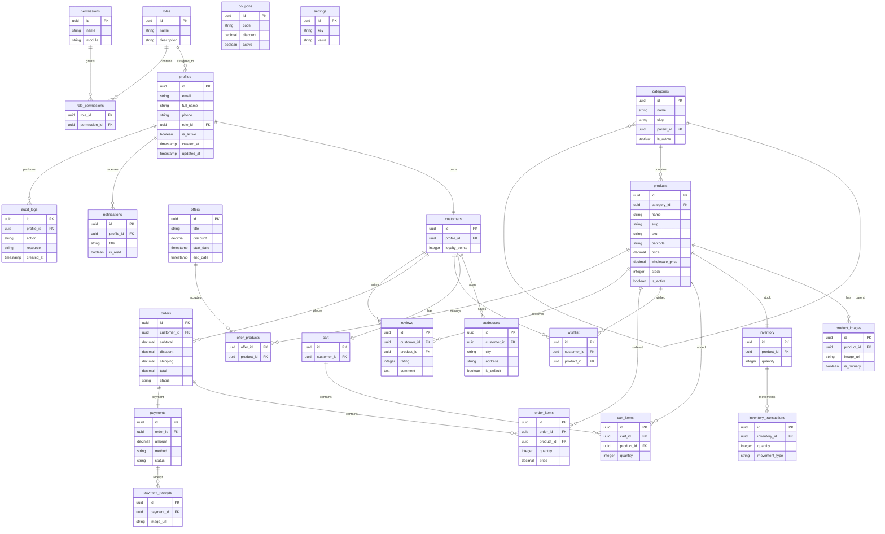

# Entity Relationship Diagram (ERD)

**File:** `docs/database/02-er-diagram.md`

---

# Purpose

يوضح هذا المستند العلاقات الكاملة بين جميع جداول قاعدة البيانات.

تم تصميم قاعدة البيانات وفقًا لمبادئ:

- Third Normal Form (3NF)
- High Performance
- Referential Integrity
- Scalability
- Maintainability

---

# Database Domains

```
Authentication

↓

Users

↓

Customers

↓

Products

↓

Orders

↓

Payments

↓

Inventory

↓

Marketing

↓

Administration

↓

System
```

---

# Entity Relationship Diagram (Mermaid)



---

# Relationship Summary

## Authentication

```
Roles

↓

Profiles

↓

Customers
```

---

## Product Catalog

```
Categories

↓

Products

↓

Images

↓

Inventory

↓

Inventory Transactions
```

---

## Shopping

```
Customer

↓

Cart

↓

Cart Items

↓

Products
```

---

## Orders

```
Customer

↓

Orders

↓

Order Items

↓

Products
```

---

## Payments

```
Orders

↓

Payments

↓

Payment Receipts
```

---

## Marketing

```
Offers

↓

Offer Products

↓

Products
```

```
Coupons

↓

Orders
```

---

## Reviews

```
Customer

↓

Reviews

↓

Products
```

---

## Notifications

```
Profiles

↓

Notifications
```

---

## Administration

```
Profiles

↓

Audit Logs
```

---

# Cardinality

## One To One

```
Profile

↓

Customer
```

```
Cart

↓

Customer
```

```
Order

↓

Payment
```

```
Product

↓

Inventory
```

---

## One To Many

```
Category

↓

Products
```

```
Product

↓

Images
```

```
Order

↓

Order Items
```

```
Customer

↓

Orders
```

```
Customer

↓

Addresses
```

```
Inventory

↓

Transactions
```

---

## Many To Many

Roles

↔ Permissions

Using

```
role_permissions
```

---

Offers

↔ Products

Using

```
offer_products
```

---

Wishlist

Customer ↔ Product

---

Cart

Cart ↔ Product

---

# Referential Integrity

Every Foreign Key

- Uses UUID
- References Primary Key
- Indexed
- Enforced by PostgreSQL
- Protected by RLS

---

# Design Decisions

- UUID primary keys
- Junction tables for many-to-many relationships
- Soft delete support
- Hierarchical categories
- Separate inventory ledger
- Independent payment records
- Audit trail for sensitive actions
- Modular entities for future expansion

---

# Future Expansion

Additional entities can be added without redesigning the schema:

- Warehouses
- Branches
- Suppliers
- Purchase Orders
- Returns
- Refunds
- Shipments
- Delivery Companies
- Loyalty Transactions
- Gift Cards
- ERP Integration
- Accounting Module
- CRM Module
- Multi-Tenant Support